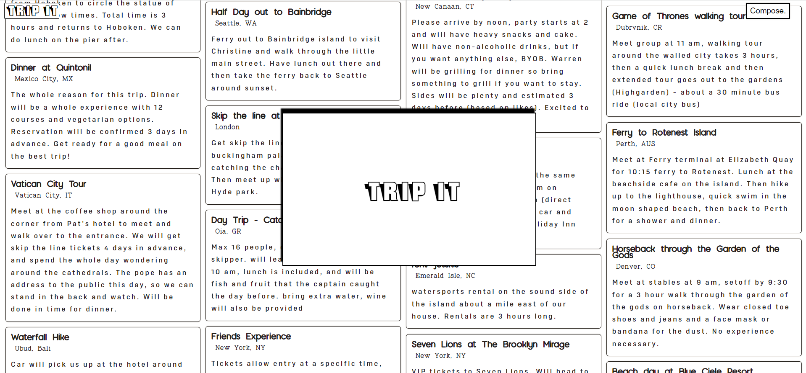

# Trip It

Link to Live site
https://trip-it.onrender.com


Have you ever wanted to plan a trip with a group of friends or family, but not known what everyone would like to do?

Enter TripIt.

A one-stop-shop web application to track and prioritize trips and events within trips. With this app, you can create a trip with a group of people and each member can suggest an event, like events, and book events while on that trip. 



Creating a trip is easy, from the UI 

```
  const submitTrip = e => {
    e.preventDefault();
    dispatch(createTrip({
      title: title,
      description: description,
      startDate: startDate,
      endDate: endDate,
      location: {
        streetAddress: streetAddress,
        city: city,
        state: state,
        zipCode: zipCode,
        country: country
      },
      organizer: sessionUser._id,
      members: [sessionUser._id],
      stampImageUrl: awsStampUrls[rand],
      tripImageUrl: 'https://sh-aws-tripit-mern.s3.amazonaws.com/tripit-public/tourism.jpeg'
    }, history));
  };
```

to the backend creation:

```
  // create a new trip
  router.post('/', async function (req, res, next) {
    if (req.body.title === '') {
        const err = new Error('No title');
        err.statusCode = 400;
        err.errors = { 'title': 'A trip must have a title' };
        return next(err);
    } else {
        const newTrip = await new Trip({
            title: req.body.title,
            startDate: req.body.startDate,
            endDate: req.body.endDate,
            description: req.body.description,
            location: req.body.location,
            organizer: req.body.organizer,
            members: req.body.members
        });

        const trip = await newTrip.save();
        return res.json(trip);
    }
  });
```  
  
  And members of a trip can like or unlike events within that trip.
  
  ```
   <div id='heart-container'>
    {event.peopleGoing.some(person => person._id === user._id)
      ?  {
        dispatch(eventActions.removeUserFromEvent(eventId, user._id))
      }} />
      :  {
        dispatch(eventActions.addUserToEvent(eventId, user._id))
      }} />
    }
    {event.peopleGoing.some(person => person._id === user._id) 
      ? <div id='people-going-hover'>who is going?</div>
      : <div id='people-going-hover'>interested?</div>
    }
    <div id='people-going-hide'>
      {eventGoingDiv}
    </div>
  </div>
  
  export const addUserToEvent = (eventId, userId) => async (dispatch) => {
    try {
        const res = await jwtFetch(`/api/events/addMember/${eventId}/${userId}`, {
            method: "PATCH"
        })
        const event = await res.json(); 
        dispatch(receiveEvent(event))
    } catch(err) {
        const resBody = await err.json(); 
        if (resBody.statusCode === 400) {
            return dispatch(receiveEventErrors(resBody.errors))
        }
    }
  };
  ```
  
  
With all modals stored in the React store.


```
  export const closeModal = () => {
  return {type: "modalOff"}
  };

  const ModalReducer = (state = {on: false, component: null}, action) => {
    switch (action.type) {
      case "modalOn":
        return {on: true, component: action.component};
      case "modalOff":
        return {on: false, component: null};
      default:
        return state;
    }
  };

  export default ModalReducer;
 ``` 
  
  
Giving the users and developers flexibility to manage their trips the way they see fit.
 


Future Developments:
* Mobile deployment
* Email invitations to users to join a trip
* Event booking deadlines
* Image selection for trip and events
* Image upload for trips and events
